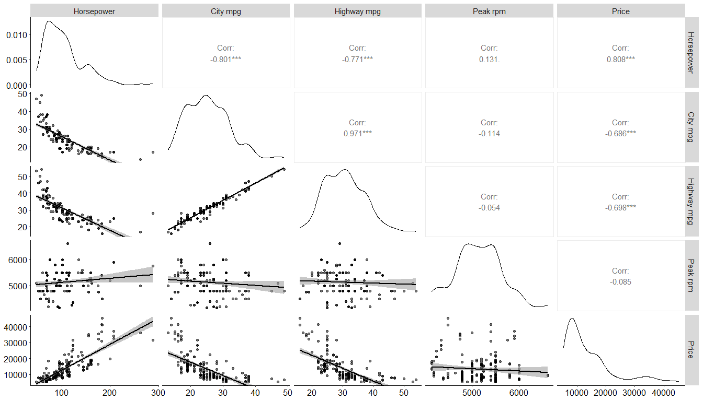
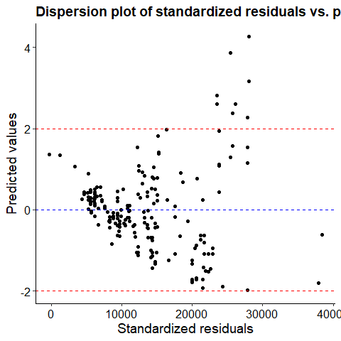
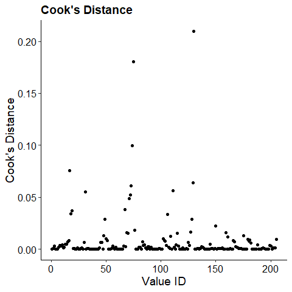
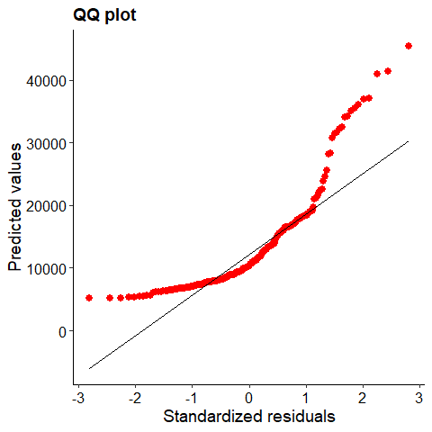
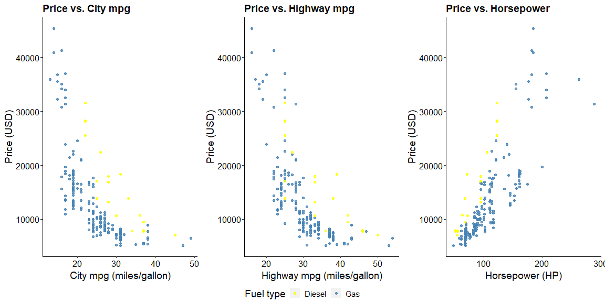

Multiple Linear Regression
================

# Aim

We want to understand the factors affecting the pricing of cars in the
American market, since those may be very different from other markets.
The dataset has several variables, but the company wants to know how
well specific variables describe the price of a car. These are:

- Fuel type the engine uses
- Power of the engine
- Consumption in city roads and highways
- Maximum frequency at which the engine operates

# Exploratory analysis

Let’s first look what the numerical data looks like (leaving out the
categorical variable fuel type, that will be included later on).



With this type of plot we can see which variables are highly correlated
with the price of the car.

Therefore, we’ll have in mind the power of the engine (horsepower,
\[HP\]), the miles per gallon reached in city roads (citympg,
\[miles/gallon\]) and in highways (highwaympg, \[miles/gallon\]) and
lastly which type of fuel does the car consumes (fueltype).

Remember, with the one-to-one correlation, we might get a glimpse of
which variables are important but we’ll fit a multiple model.

Based on the graph, we could reasonably assume there is a linear
relationship between these variables. The maximal model we aspire to fit
is as follows:

$E[Car\hspace{0.3em}Price_i | horsepower_i, citympg_i, highwaympg_i, fueltype_i] = \beta_0 + \beta_1 * horsepower_i + \beta_2 * citympg_i + + \beta_3 * highwaympg_i + + \beta_4 * fueltype_i$

We will discard any interaction between variables not only for
simplicity but also for a logical reason: we do not expect these
variables to affect the pricing of the car in a non additive manner.

# Running different possible models

We’ll try to adjust our data to different models, each variable alone,
and combining all of them in an additive way. We’ll try also the null
model just for the sake of comparison.

``` r
modelo1 = lm(data = cars, price ~ 1) #Null model
modelo2 = lm(data = cars, price ~ fueltype)
modelo3 = lm(data = cars, price ~ horsepower)
modelo4 = lm(data = cars, price ~ citympg)
modelo5 = lm(data = cars, price ~ highwaympg)
modelo6 = lm(data = cars, price ~ fueltype + horsepower + citympg + highwaympg)
```

# Model selection

There are different ways to go (for more, see Johnson, J. B., & Omland,
K. S. (2004). Model selection in ecology and evolution. Trends in
ecology & evolution,19(2), 101-108):

- Forward, backward, stepwise methods
- Different metrics (maximal R2 adj., AIC/BIC criterion, keep
  significant/important coefficients first)

### Ranking by AIC

To get a quick intuition of which model performed best, we’ll rank them
by AIC, since they’re nested models.

``` r
knitr::kable(ranking)
```

|         |  df |      AIC |
|:--------|----:|---------:|
| modelo1 |   2 | 4268.941 |
| modelo2 |   3 | 4268.639 |
| modelo3 |   3 | 4053.911 |
| modelo4 |   3 | 4140.693 |
| modelo5 |   3 | 4134.250 |
| modelo6 |   6 | 4005.536 |

The lower the AIC, the better the model’s performance. In our analysis
we can see that the lowest AIC is for the 6th model. Such model
establishes that the price depends on all of the variables included.

# Checking assumptions

``` r
#Residuals + predicted values
e <-residuals(modelo6) # residuals
re <-rstandard(modelo6) #standarized residuals
pre <-predict(modelo6) #predict

# Gather observed data, resid, and predicted values
res <- cbind.data.frame(pre, e, round(re,2))
colnames(res) <- c("pred", "resid", "std_resid") 
might_be_outliers = res %>% filter(abs(std_resid)>2)
```

### Outlier detection: Observed vs predicted values

We expect all values of standardized residuals to be in range $\pm$ 2.
As we can see, there is no major deviations from this assumption.



Some values seems to be off, but they represent 4%, so it’s OK to
continue with the analysis, keeping all data, and not diving much into
these.

### Leveraging points

We can study the global effect of one observation on the model’s
estimates by using the Cook’s distance.



Values with D \> 1 are considered high leveraging. Since we’re not
having any, there are no such datapoints.

### Normality test: QQ plot

If the data follows a normal distribution, the quantile-quantile plot
should show the dots aligned with an exact diagonal line.



In spite of showing high skewness at low and high values, in general,
linear models are moderatedly strict about the normality assumption
given that homocedasticity is present.

# Analyzing the results

Let’s look how the price vary on each variable by fuel type. As we have
3 numerical variables, it is impossible to make a joint plot considering
all of them all together, because we can’t plot in 2D a multidimensional
set. Also, we do not expect *each* of them to be linear with price, but
the sum. In spite of this we can perform an overall analysis:

- We can see that more efficient cars (i.e. low mpg both in the city and
  in highway) have higher prices.

- There are less diesel cars in the dataset than there are gas ones, but
  the data per fuel type are not entangled, but mildly separated. For
  example, for city mpg, the distribution of diesel data seems to be
  shifted towards higher values than gas’ ones.



|                 | Estimate | Std. Error | t value | Pr(\>\|t\|) |
|:---------------:|:--------:|:----------:|:-------:|:-----------:|
| **(Intercept)** |  12443   |    3357    |  3.707  |  0.0002715  |
| **fueltypegas** |  -6577   |    1050    | -6.261  |  2.294e-09  |
| **horsepower**  |  142.2   |   12.39    |  11.48  |  9.542e-24  |
|   **citympg**   |  259.2   |   210.4    |  1.232  |   0.2196    |
| **highwaympg**  |  -473.8  |   184.3    |  -2.57  |   0.01089   |

| Observations | Residual Std. Error | $R^2$  | Adjusted $R^2$ |
|:------------:|:-------------------:|:------:|:--------------:|
|     205      |        4162         | 0.7339 |     0.7286     |

Fitting linear model: price \~ fueltype + horsepower + citympg +
highwaympg

Let´s see what the results of the models are:

- We can get the **estimated coefficients** for each variable, being
  citympg the only one non significant. Albeit that, we’ll keep it in
  our model because we stated previously that customers might be driven
  by buying one type of car or the other based on energetical
  consumption. That is, we do not drop variables only because they are
  not statistically significant.
- We can also assess which variable is more or less significant than
  others to establish the price of cars. With no doubt, the type of fuel
  and the horsepower dominate the value of the car.
- **R2 adj.** measures the goodness of fit penalized by variable number
  (i.e controlling overfitting), we have got very good fit, since
  $R^2 = 0.73$.
- Finally, we’ve got a measurement of the **residual standard error
  (RSE)** (how well/bad our regression model predicts values). In this
  case, $RSE = 4162$, which means that the model predicts the value of
  the car with an error of $\pm\hspace{0.3em}4162\hspace{0.3em}USD$.

# Conclusion and predictions

We were able to determine that all the variables are important in our
multiple linear model in order to determine the price of cars.

Furthermore, we can make use of the estimates given by the model in
order to predict the price of a car we don’t know how much should we pay
for it. Suppose we have a deal for a car that shows the following data:

| Variable    | Value           |
|-------------|-----------------|
| Horsepower  | 150 HP          |
| Highway mpg | 25 miles/gallon |
| City mpg    | 20 miles/gallon |
| Fuel type   | Gas             |

We can then use our model in order to estimate the value.

$Car\hspace{0.3em}price = 12443 + 142 * 150 + 259*20 -473*25 -6577 * 1$

$Car\hspace{0.3em}price = 20521\hspace{0.3em}USD$

We’d expect to place an offer for about 20,000 USD (considering the RSE
of the model and how much we wish to negotiate starting from that
price).
